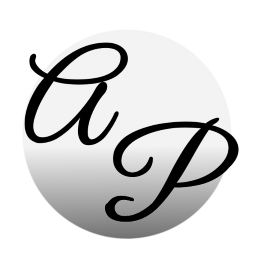

<h1 align="center"><strong>airPiano</strong>
</h1>
<h1 align="center"></h1>
<h5 align="center"><strong>A software with which you can play piano in the air, or play a bigger piano with the computer keyboard.</strong>
</h5>

<h5 align="center">

 

</h5>

# :page_with_curl: Contents

1. [Features](#Features)
2. [Installation](#Installation)
3. [Screenshots](https://github.com/Karthikeshwar1/Araam#screenshots)
4. [Credits](https://github.com/Karthikeshwar1/Araam#credits)
5. [License](https://github.com/Karthikeshwar1/Araam#license)

 

# :sparkles: Description

## Featurs:

This program has two components:
* airPiano: Play piano with fingers in the air
* keyPiano: Play piano with the computer keyboard.
* Record/Play/Skip-to-start: Record audio from microphone and play it, or select any audio file and play piano with it.
* Sustain-controls: For keypiano, sustain can be turned on (sound will play even if the piano key is released) or off (sound will play as long as the key is pressed or until it stops)

## Working:

airPiano works by hand-tracking with the help of [mediapipe](https://mediapipe.dev/) framework. A finger is down, if, say for index finger (from image below) the tip (8) is below the distal part (7). The audio plays when the key is down.

<h1 align="center"></h1>

source: [Mediapipe](https://google.github.io/mediapipe/solutions/hands.html)

 

# 🛠️ Installation

Coming soon!

 

# 🎞️ Screenshots

<h1 align="center"></h1>

<h1 align="center"></h1>

<h1 align="center"></h1>

 

# 🧾 Credits

Program is written in Python with the help of the following amazing tools:
* [PyQt5](https://riverbankcomputing.com/software/pyqt)
* [PyAutoGUI](https://pypi.org/project/PyAutoGUI/)
* [Mediapipe](https://mediapipe.dev/)
* [OpenCV](https://opencv.org/)
* and several other python packages.

App icon was created by me.

# License

[s](https://choosealicense.com/licenses/agpl-3.0/)

 
